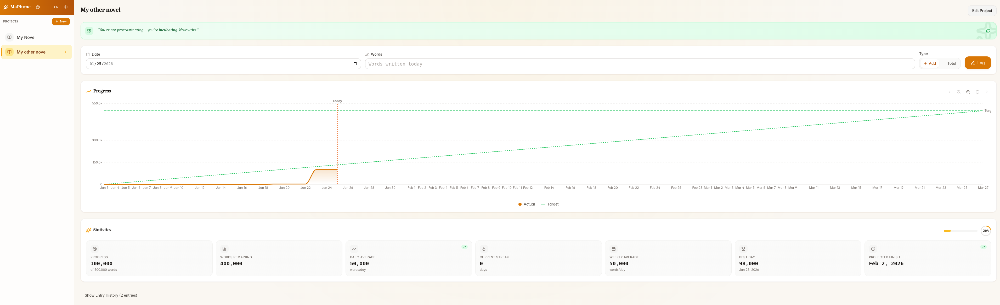

# MaPlume

A beautiful, distraction-free word tracker for novel writers. Track your daily writing progress, visualize your journey, and stay motivated to reach your goals.

**[🌐 Website](https://yurug.github.io/maplume/)** | **[⬇️ Download](https://github.com/yurug/maplume/releases/latest)**


[](https://github.com/sponsors/yurug)

---



## Features

- **Multiple Projects** - Track progress across different writing projects with custom icons
- **Visual Progress** - Interactive chart showing your progress vs. target trajectory
- **Smart Statistics** - Daily averages, streaks, projected completion dates, and more
- **Global Statistics** - See your entire writing journey across all projects
- **Flexible Units** - Track words, pages, or chapters - whatever works for you
- **Custom Backgrounds** - Personalize each project with colors or images
- **Motivational Messages** - Encouraging prompts based on your writing trends
- **Dark Mode** - Easy on the eyes during late-night writing sessions
- **Local-First** - Your data stays on your machine, with optional cloud sync
- **Multi-Language** - Available in English and French
- **Auto-Updates** - Seamless updates without re-downloading the app

<details>
<summary><strong>📸 More Screenshots</strong></summary>

### Create a New Project

Choose from multiple icons, set your target in words/pages/chapters, and customize the background.


</details>

## Installation

### Windows

1. Download `MaPlume.Setup.x.x.x.exe` from the [latest release](https://github.com/yurug/maplume/releases/latest)
2. Run the installer
3. MaPlume will be available in your Start Menu

### macOS

1. Download `MaPlume-x.x.x-universal.dmg` from the [latest release](https://github.com/yurug/maplume/releases/latest)
2. Open the DMG file
3. Drag MaPlume to your Applications folder
4. **Important:** MaPlume is not signed with an Apple Developer certificate. You'll need to allow it in System Preferences. See the **[detailed macOS installation guide](docs/installation-macos.md)** | **[Guide en français](docs/installation-macos-fr.md)**

> **Why isn't it signed?** Apple charges $99/year for a Developer certificate. [Help us remove this barrier by sponsoring the project.](https://github.com/sponsors/yurug)

### Linux

#### AppImage (Recommended)
1. Download `MaPlume-x.x.x.AppImage` from the [latest release](https://github.com/yurug/maplume/releases/latest)
2. Make it executable:
   ```bash
   chmod +x MaPlume-x.x.x.AppImage
   ```
3. Run it:
   ```bash
   ./MaPlume-x.x.x.AppImage
   ```

#### Optional: Desktop Integration
To add MaPlume to your application menu:
```bash
# Create desktop entry
cat > ~/.local/share/applications/maplume.desktop << EOF
[Desktop Entry]
Name=MaPlume
Exec=/path/to/MaPlume.AppImage
Icon=maplume
Type=Application
Categories=Office;WordProcessor;
EOF
```

## Auto-Updates

MaPlume automatically checks for updates and will notify you when a new version is available. Updates are lightweight (~400KB) and install seamlessly without re-downloading the entire app.

## Data Storage

MaPlume stores your data locally in a folder you choose during first launch. This makes it easy to:
- Back up your data
- Sync via cloud storage (Dropbox, Google Drive, OneDrive, etc.)
- Move your data between machines

## Building from Source

### Prerequisites
- Node.js 20+
- npm

### Development
```bash
# Install dependencies
npm install

# Start development server
npm run dev
```

### Build
```bash
# Build for production
npm run build

# Create distributable for your platform
npm run dist

# Or build for a specific platform
npm run dist:win     # Windows
npm run dist:mac     # macOS
npm run dist:linux   # Linux
```

## Contributing

Contributions are welcome! Please feel free to submit a Pull Request.

## License

MIT License - see [LICENSE](LICENSE) for details.

## Support

If MaPlume helps you in your writing journey, consider [sponsoring the project](https://github.com/sponsors/yurug) ☕

---

<p align="center">
  Made with ❤️ for writers everywhere
</p>
